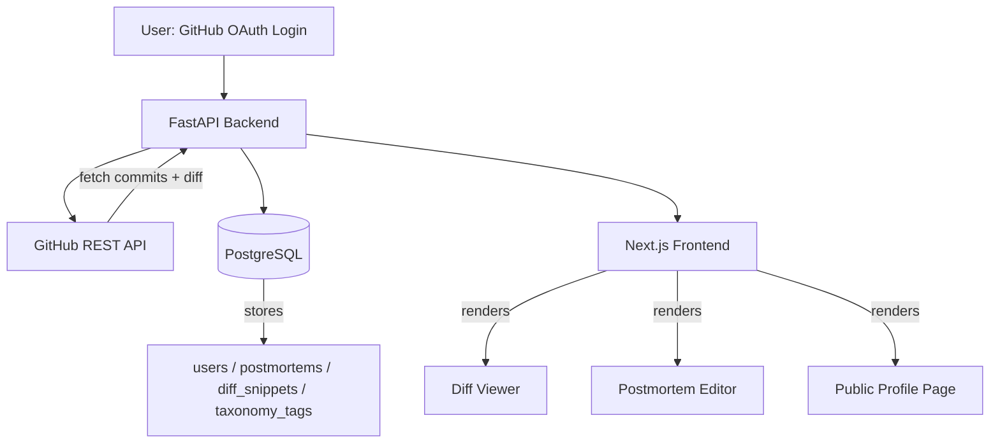

# 🏗️ Architecture

## The Technical Anti-Portfolio

---

## 1. High-Level System Diagram

---

## 2. Component Breakdown

### 2.1 Frontend — Next.js 14 + TypeScript + Tailwind CSS
- **Auth flow:** GitHub OAuth via NextAuth.js
- **Repo/commit picker:** calls backend, lists user's repos and commit history
- **Diff viewer:** `react-diff-viewer` or `diff2html`, rendered from backend-tokenized diff (never raw client-side eval)
- **Postmortem editor:** Markdown-enabled form (hypothesis, breaking point, architectural rule, tags)
- **Public profile page:** `/u/:username` — server-rendered, read-only, SEO-friendly

### 2.2 Backend — FastAPI (Python)
- **Auth service:** handles GitHub OAuth token exchange, session management
- **GitHub Ingestion Engine:** calls `/repos/{owner}/{repo}/compare/{base}...{head}` to extract the diff between two commits
- **Diff processor:** strips lockfiles/binary noise, enforces a max diff size (e.g. 250 KB) to keep payloads sane
- **Sanitization layer:** tokenizes/escapes all fetched code server-side before it ever reaches the frontend — no raw `eval()`, no unsanitized HTML injection
- **Postmortem API:** CRUD endpoints for postmortems and tags

### 2.3 Database — PostgreSQL
See [SCHEMA.md](./SCHEMA.md) for full entity definitions.

### 2.4 Deployment
- **Frontend:** Vercel
- **Backend + DB:** Render or Railway
- **Environment separation:** `.env` for local dev, platform-level secrets for production (GitHub OAuth client ID/secret, DB URL)

---

## 3. Data Flow (Core User Journey)

1. User logs in via GitHub OAuth.
2. User selects a repo → backend fetches commit list from GitHub API.
3. User picks a "buggy" commit and a "fix" commit → backend calls `/compare/{base}...{head}`.
4. Backend strips lockfiles, sanitizes the diff, stores it as a `diff_snippet`.
5. User writes a postmortem attached to that diff, adds taxonomy tags.
6. Postmortem + diff render together on the user's public profile page.

---

## 4. Key Architectural Decisions

| Decision | Rationale |
|---|---|
| Manual tagging instead of AST auto-detection (MVP) | AST-based classification is a non-trivial ML/parsing sub-project on its own — deferred to v2 to keep MVP shippable |
| Server-side diff sanitization | Prevents stored code injection — user-submitted diffs must never be rendered as raw executable HTML/JS |
| No telemetry mockups in MVP | Fake resource graphs risk looking dishonest to recruiters if not clearly backed by real data — explicitly excluded until real telemetry integration is feasible |
| Single-user scale, no Redis/token pooling yet | Premature infra for a personal-scale tool; revisit only if the platform grows multi-user |

---

## 5. Security Considerations

- Zero client-side `eval()` execution on any fetched or user-submitted code.
- All diffs tokenized and sanitized server-side into static, safe HTML before rendering.
- GitHub OAuth tokens stored encrypted, never exposed to the frontend.
- Rate-limit awareness: batch/cache GitHub API calls per user session to avoid hitting the 5,000 req/hr ceiling.
