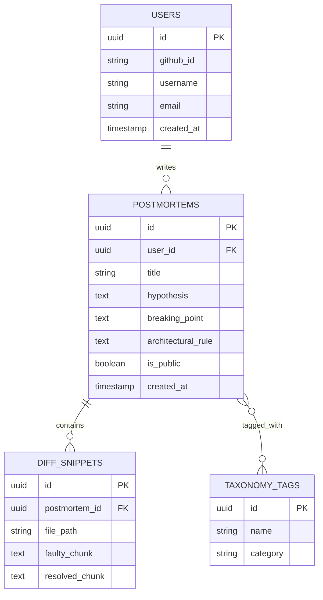

# 🗄️ Database Schema

## The Technical Anti-Portfolio — PostgreSQL

---

## Entity Relationship Overview

---

## Table Definitions

### `users`
| Column | Type | Notes |
|---|---|---|
| `id` | UUID (PK) | Primary key |
| `github_id` | VARCHAR | Unique, from GitHub OAuth |
| `username` | VARCHAR | Display name / profile URL slug |
| `email` | VARCHAR | From GitHub OAuth scope |
| `created_at` | TIMESTAMP | Default `now()` |

### `postmortems`
| Column | Type | Notes |
|---|---|---|
| `id` | UUID (PK) | Primary key |
| `user_id` | UUID (FK → users.id) | Owner |
| `title` | VARCHAR | Short incident title |
| `hypothesis` | TEXT | Initial theory of what went wrong |
| `breaking_point` | TEXT | What actually failed and why |
| `architectural_rule` | TEXT | The generalized lesson/rule derived |
| `is_public` | BOOLEAN | Whether it shows on public profile |
| `created_at` | TIMESTAMP | Default `now()` |

### `diff_snippets`
| Column | Type | Notes |
|---|---|---|
| `id` | UUID (PK) | Primary key |
| `postmortem_id` | UUID (FK → postmortems.id) | Parent postmortem |
| `file_path` | VARCHAR | Affected file |
| `faulty_chunk` | TEXT | Buggy code (sanitized) |
| `resolved_chunk` | TEXT | Fixed code (sanitized) |

### `taxonomy_tags`
| Column | Type | Notes |
|---|---|---|
| `id` | UUID (PK) | Primary key |
| `name` | VARCHAR | e.g. `#RaceCondition`, `#MemoryLeak`, `#Deadlock` |
| `category` | VARCHAR | e.g. `Concurrency`, `Memory`, `Database` |

A join table `postmortem_tags (postmortem_id, tag_id)` links postmortems to tags (many-to-many).

---

## Indexing Notes
- Index `postmortems.user_id` for fast profile-page lookups.
- Index `postmortem_tags.tag_id` for tag-filtered browsing.
- `users.github_id` should be `UNIQUE`.
